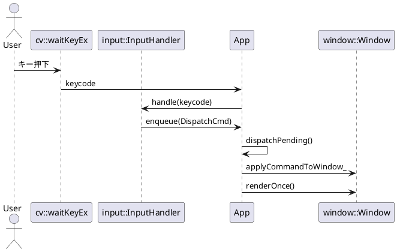

# アプリパッケージ設計メモ（app）（刷新版）

> 対象: `./src/app/{include/app/*.hpp, *.cpp}`

本メモは **ゲームループ / コマンドディスパッチ / フォーカス管理 / レンダリング制御** を担う `app` パッケージの設計意図・公開API・実装ポリシー・拡張方針をまとめたものです。`cmd`/`input`/`window` と連携し、**単一経路の副作用（dispatch 経由）** を徹底します。

---

## 1. 目的と責務（Scope）

* **ゲームループの司令塔**：`processInput → update → render → dispatch` のフレーム駆動を提供。
* **コマンド実行の単一地点**：`DispatchCmd` を取り出して宛先解決・適用（アプリ/ウィンドウ）。
* **フォーカス管理**：`focused_id_` により「どのウィンドウが対象か」を一元化。
* **描画制御**：`skip_render_once_` によるフレームスキップ/HighGUIイベント駆動と整合。

非責務：キー→コマンド変換（`input`）、画像取得（`video`）、描画個別最適化（`window`）。

---

## 2. 公開API（案）

```cpp
// include/app/app.hpp（案）
namespace app {
  class App {
  public:
    App();
    ~App();

    int  run();                                 // メインループ

    // ループ各段階（単体テストや埋め込み制御用）
    void processInput();                        // HighGUI の入力→input::InputHandler
    void update();                              // 状態更新（タイマ/アニメ/遷移）
    void render();                              // 全 Window の描画（window::Window::renderOnce）

    // コマンド経路
    void enqueue(const cmd::DispatchCmd&);      // 入力等からキューに積む
    void dispatchPending();                     // 保留コマンドを全て適用

    // ウィンドウ管理
    win::WindowId addWindow(win::Window&&);
    void focusNext();                           // フォーカス移動

    // 参照
    const std::vector<win::Window>& windows() const noexcept;

  private:
    //=== 状態フィールド ===
    std::vector<win::Window> windows_;
    win::WindowId            focused_id_{0};
    std::deque<cmd::DispatchCmd> cmd_que_;

    input::InputHandler      input_;
    bool                     running_{true};
    bool                     skip_render_once_{false};

    //=== 内部ユーティリティ ===
    void dispatchOne_(cmd::DispatchCmd&&);
    void handleAppLevelCommand_(const cmd::Command&);
    void applyCommandToWindow_(win::Window& w, const cmd::Command&);
    void dispatchToAll_(const cmd::Command&);
    void dispatchToFocused_(const cmd::Command&);
    void dispatchToId_(win::WindowId id, const cmd::Command&);
    void finalizeDispatch_();                    // cv::waitKey(1) と描画スキップ処理
  };
}
```

---

## 3. ライフサイクル

1. **初期化**：ロガー設定・`input` 既定バインディングの導入・初期ウィンドウ生成
2. **実行**：メインループ（`processInput → update → render → dispatchPending`）
3. **終了**：ウィンドウ破棄・リソース解放

---

## 4. ゲームループ（フレーム駆動）

* **processInput**：`cv::waitKeyEx` でキーコード取得→ `input::InputHandler::handle()` → `cmd_que_` に積む
* **update**：状態の時間発展（必要に応じてスキップ可）
* **render**：全 `window::Window` に対し `renderOnce()` を呼ぶ（`skip_render_once_` 対応）
* **dispatchPending**：キューから `DispatchCmd` を取り出し、宛先に応じて適用

> ループ段階の副作用は **dispatch 経由** に限定し、整合性を担保します。

---

## 5. コマンドディスパッチ（Envelope 運用）

* `DispatchCmd = Target + Command`（例：`TargetFocused + CmdToggleFullscreen`）
* 宛先解決：`TargetAll` / `TargetFocused` / `TargetById`
* 実行点：`applyCommandToWindow_` に集約し、Window APIへ橋渡し
* 代表コマンド：

  * `CmdQuit` → `running_ = false`
  * `CmdToggleFullscreen` → `Window::setFullscreen(!)`
  * `CmdMoveToMonitor{index}` → `Window::moveToMonitor(index)`
  * `CmdFocusNext` → `focusNext()`

---

## 6. フォーカス管理

* `focused_id_` を循環的に更新（ウィンドウ数 0 の場合は no-op）
* `TargetFocused` は常に `focused_id_` を参照
* 破棄・非表示などによりフォーカス先が失効した場合は、先頭へフォールバック

---

## 7. 入力レイヤ連携

* `input::InputHandler` に既定バインディングをインストール（例：ESC/q で Quit、F で Fullscreen、TAB で FocusNext、'1'/'2' で monitor 移動）
* `handle()` の発火点は `processInput()` のみ（**入力→キュー→dispatch** の単一路）

---

## 8. スレッド & パフォーマンス

* **基本方針**：HighGUI の性質上、UI操作はメインスレッドで実施
* **将来の分離**：入力/描画スレッドを分離する場合、`cmd_que_` をスレッドセーフ化（`mutex` or lock-free）
* **描画スキップ**：`skip_render_once_` で計算負荷の平滑化やフレーム同期を調整

---

## 9. エラーハンドリング & ロギング

* **種類**

  * 回復可能：不正な宛先ID、ウィンドウ0件時のフォーカス操作 → `warn` ログ
  * 致命的：HighGUI 初期化失敗 → 例外送出
* **ログ方針**：ソース位置信息（file:line:function）を付与するマクロを使用し、**入力ログ**と**適用ログ**を分離

---

## 10. CMake / 依存関係

* `app` は **PRIVATE** に `input` をリンク（`cmd` は `input` が PUBLIC で輸送）
* `window` は **PUBLIC** に要求されるため、`app` からは **PRIVATE** で十分
* サブディレクトリ順序：`src/cmd` → `src/input` → `src/window` → `src/app`

---

## 11. テスト & 検証チェックリスト

* [ ] 既定バインディング：各キーが正しい `DispatchCmd` を積む
* [ ] `TargetAll / Focused / ById` の宛先解決と適用順序
* [ ] `focusNext()` の循環と例外系（ウィンドウ0件/1件）
* [ ] `skip_render_once_` の挙動（連続ディスパッチ時の描画抑制）
* [ ] `CmdQuit` の終了条件（ループ即時抜け）

---

## 12. 将来拡張

* **コマンド拡張**：`CmdSetLayout{LayoutMode}` / `CmdSetScale{double}` / `CmdShowOverlay{bool}` 等
* **スクリプト/IPC**：JSON/CLI/ソケット経由で `DispatchCmd` を投入
* **リプレイ**：コマンド列の記録・再生による E2E デバッグ
* **タイムライン**：ステート遷移/アニメの導入（`update` の実効活用）

---

## 13. PlantUML（クラス & シーケンス）

```plantuml
@startuml
package app {
  class App {
    -windows_: vector<win::Window>
    -focused_id_: win::WindowId
    -cmd_que_: deque<cmd::DispatchCmd>
    -input_: input::InputHandler
    -running_: bool
    -skip_render_once_: bool
    +run()
    +processInput()
    +update()
    +render()
    +enqueue(cmd)
    +dispatchPending()
  }
}

package cmd { class DispatchCmd }
package window { class Window }
package input { class InputHandler }

App --> "*" Window
App --> DispatchCmd : uses
App --> InputHandler : uses
@enduml
```



---

## 14. 実装ポリシー（要点）

* **単一経路の副作用**：UI副作用は `dispatch` → `window` API 経由に限定
* **循環依存の回避**：`WindowId` は共通型として `window_types.hpp` に集約し、`cmd` からは前方参照
* **可観測性**：コマンド発行ログ（入力）と適用ログ（dispatch）を分け、デバッグ容易性を確保
* **フェイルセーフ**：宛先不在時は no-op + `warn`、想定外例外は速やかに中断

---

### 付録：命名規約（要約）

* メンバ末尾に `_`、関数は `lowerCamel`、型は `PascalCase`
* `WindowId` は `uint32_t`（0 は未割当）
* ループ内の `cv::waitKey(1)` は `finalizeDispatch_()` に集約
