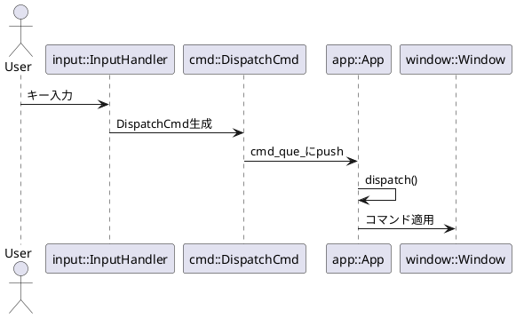

# アーキテクチャ設計

このドキュメントは、本プロジェクトのパッケージ構成と設計思想をまとめたものです。

---

## 全体像

---

## App パッケージ

* **ゲームループ**: processInput → update → render → dispatch
* **コマンドキュー方式**: 入力と処理を分離
* **Envelope方式**: TargetとCommandをひとまとめ

---

## cmd パッケージ

* **Command**: Quit, ToggleFullscreen, MoveToMonitor, FocusNext
* **Target**: All, Focused, ById
* **DispatchCmd**: Target + Command のEnvelope

---

## input パッケージ

* **InputHandler**: keycodeにActionをbind/unbind
* **既定バインディング**: ESC/qで終了, Fでフルスクリーン, TABでフォーカス移動
* **設計注意**: スレッド安全性、ラムダキャプチャ

---

## 将来拡張

* スクリプト入力・コマンドリプレイ
* ネットワーク越しの操作
* グルーピングによるマルチウィンドウ制御
