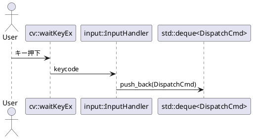

# input パッケージ設計メモ（刷新版）

> 対象: `./src/input/{include/input/*.hpp, *.cpp}` と、その配下で **エンベロープ定義（cmd）を“子パッケージ的に”扱う構成**。

本メモは **キー入力 → コマンド（DispatchCmd）** への変換レイヤである `input` の設計意図・公開API・実装ポリシー・拡張方針をまとめたものです。`cmd` を **INTERFACE（ヘッダのみ）として PUBLIC 依存**に置き、利用側（`app` など）へ再輸送します（= `input` を通して `cmd` を使える）。

---

## 1. 目的と責務（Scope）

* **入力イベントの正規化**：HighGUI（`cv::waitKeyEx`）から得たキーコードを抽象化。
* **非同期吸収**：即時実行を避け、**コマンドキューに積む**（実行は `app::dispatch`）。
* **既定バインディング**：最低限の操作（Quit/Fullscreen/Monitor移動/Focus移動）を標準で提供。

非責務：ウィンドウ操作の実体、描画、ステート管理（それらは `window`/`app` 側）。

---

## 2. 公開API（案）

```cpp
// include/input/input_handler.hpp（抜粋）
namespace input {
  class InputHandler {
  public:
    using Action = std::function<void()>;

    void bind(int keycode, Action action);
    void unbind(int keycode);
    bool bound(int keycode) const;
    void clear();

    // 未入力(-1)は内部で無視。発火時は登録済みActionを実行（※通常はキューにコマンドpush）
    void handle(int keycode) const;
  private:
    std::unordered_map<int, Action> map_;
  };
}
```

```cpp
// include/input/bindings_default.hpp（抜粋）
namespace input {
  // 既定バインディングの導入（エンベロープは cmd::* を使用）
  void install_default_bindings(InputHandler& handler,
                                std::deque<cmd::DispatchCmd>& dispatch_queue);
}
```

> **ポイント**：`bind` の Action では **副作用（描画・UI操作）を起こさない**。あくまで `dispatch_queue` に `DispatchCmd` を積むだけ。

---

## 3. ライフサイクル

1. **初期化**：`App` の起動時に `install_default_bindings(handler, cmd_que_)` を呼ぶ。
2. **入力処理**：`processInput()` が `cv::waitKeyEx()` の戻り値を `handler.handle(keycode)` に渡す。
3. **ディスパッチ**：`app::dispatchPending()` がキューから取り出し、宛先（Target）へ適用。

---

## 4. 既定バインディング（初期セット）

| キー              | コマンド                  | 宛先(Target)      | 説明                |          |
| --------------- | --------------------- | --------------- | ----------------- | -------- |
| `ESC`, `q`, `Q` | `CmdQuit`             | `TargetAll`     | アプリ終了要求           |          |
| `F`             | `CmdToggleFullscreen` | `TargetFocused` | フォーカス中ウィンドウの全画面切替 |          |
| `'1'`, `'2'`    | `CmdMoveToMonitor{1   | 2}`             | `TargetFocused`   | 指定モニタへ移動 |
| `TAB`           | `CmdFocusNext`        | `TargetFocused` | 次のウィンドウへフォーカス移動   |          |

> **ログ指針**：発火時に `info` ログ。**ログ文言 ≒ 実コマンド**に揃える（例：“MonitorMove”と“FocusNext”を取り違えない）。

---

## 5. コマンド経路（cmd を子パッケージ的に運用）

* **エンベロープ**：`DispatchCmd = Target + Command`。
* **生成点**：`InputHandler` の Action 内で `dispatch_queue.push_back(DispatchCmd{...})`。
* **実行点**：`app::dispatch` 側（`window` API への橋渡し）。
* **依存の扱い**：`input` は `cmd_api` に **PUBLIC 依存**。`app` は `input` に **PRIVATE 依存**でよい（`cmd_api` が再輸送される）。

---

## 6. スレッド & パフォーマンス

* **メインスレッド原則**：UI起点の入力はメインスレッドで取得。
* **将来の分離**：入力と描画を分離する場合は、`dispatch_queue` への push を**同期化**（`std::mutex` など）。
* **ラムダキャプチャ**：`[&]` の安易な参照キャプチャは寿命破綻の温床。**必要な値だけを値キャプチャ**に。

---

## 7. エラーハンドリング & ロギング

* **未バインドキー**：`handle(-1)` や未登録キーは黙殺（ログ不要）。
* **ハンドラ例外**：Action 実行中の例外は**握り潰さず**上位へ。入力層は黙殺しない主義（デバッグ容易性）。
* **観測性**：`trace` で押下キーコード、`info` でコマンド発行を記録。

---

## 8. CMake / 依存関係

* `cmd` を **INTERFACE ライブラリ**として定義（ヘッダのみ）。
* `input` は `target_link_libraries(input PUBLIC cmd_api)` で **再輸送**。
* `app` は `target_link_libraries(app_target PRIVATE input)`（`cmd_api` を明示リンク不要）。
* サブディレクトリ順序：`src/cmd` → `src/input` → `src/window` → `src/app`。

---

## 9. テスト & 検証チェックリスト

* [ ] `ESC/q/Q` で `CmdQuit(TargetAll)` がキューに積まれる
* [ ] `F` で `CmdToggleFullscreen(TargetFocused)` が積まれる
* [ ] `'1'/'2'` で `CmdMoveToMonitor{1|2}` が積まれる
* [ ] `TAB` で `CmdFocusNext` が積まれる
* [ ] 未登録キーや `-1` は無視
* [ ] ログ文言と実コマンドの一致
* [ ] 連打・同時押下時の順序性（先入先出）

---

## 10. 将来拡張

* **バインディング切替**：プロファイル（撮影モード/投影モード）ごとにバインドセットを差替え。
* **モディファイア**：`Ctrl/Alt/Shift` 組合せでコマンド分岐（`keycodes.hpp` に修飾子表現を導入）。
* **スクリプト入力**：JSON/IPC 経由で外部から `DispatchCmd` を注入（自動テスト/遠隔操作）。
* **リプレイ**：押下ログからのコマンド列再生（E2E再現）。

---

## 11. PlantUML（クラス & シーケンス）

```plantuml
@startuml
package input {
  class InputHandler {
    -map_: unordered_map<int, Action>
    +bind(key, action)
    +unbind(key)
    +bound(key)
    +clear()
    +handle(key)
  }
}

package cmd { class DispatchCmd }

InputHandler --> DispatchCmd : generate/push
@enduml
```



---

## 12. 実装ポリシー（要点）

* **単一経路の副作用**：入力レイヤでは**副作用を起こさず**、キュー投入のみに徹する。
* **再輸送（re-export）**：`cmd_api` は `input` の PUBLIC 依存で再輸送し、上位は `input` さえリンクすれば使える構造。
* **命名統一**：バインディング名とログ文言、コマンド名の整合を保つ（運用時混乱を避ける）。
* **プラットフォーム差**：`waitKeyEx` の戻り値は環境差があるため、`keycodes.hpp` 側で正規化テーブルを準備。

---

### 付録：命名規約（要約）

* 関数名は `lowerCamel`、型は `PascalCase`、メンバ末尾に `_`
* キーコードは `int`（HighGUI互換）だが、論理キーは `keycodes.hpp` の列挙・定数で表現
* 既定バインディングは **ドキュメントとコードを二重管理**（乖離防止）
