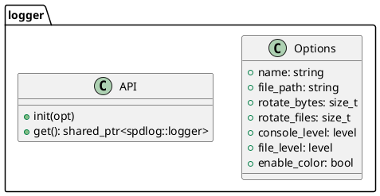
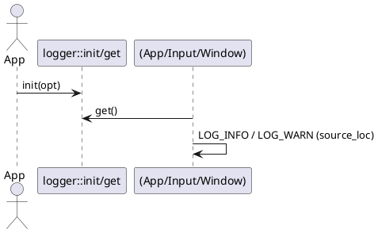

# ロガーパッケージ設計メモ（logger）

> 対象: `./src/logger/{include/logger/*.hpp, logger_setup.cpp}`

本メモは **spdlog ベースのロギング基盤**である `logger` パッケージの設計意図・公開API・実装ポリシー・拡張方針をまとめたものです。**ソース位置（file:line:function）付きログ**、**色付きコンソール**、**ローテーションファイル**、**環境変数でのレベル切替**を前提とします。

---

## 1. 目的と責務（Scope）

* **初期化の一元化**：コンソール/ファイル両方のシンクを構成（パターン・ローテーション・flushポリシ）。
* **取得インターフェース**：`spdlog::logger` インスタンス（またはグローバルデフォルトロガー）のアクセサを提供。
* **マクロ提供**：`LOG_INFO` などの**ソース位置付き**マクロで運用統一。
* **可観測性の指針**：実行時レベル切替（ENV），致命ログでの即時 flush。

非責務：アプリの状態制御、ファイルローテーション以外のログ保管戦略（外部集約など）。

---

## 2. 公開API（案）

```cpp
// include/logger/logger_setup.hpp（案）
#pragma once
#include <memory>
#include <string>
#include <spdlog/spdlog.h>

namespace logger {
  struct Options {
    std::string name         {"app"};
    std::string file_path    {"logs/app.log"};
    size_t      rotate_bytes {5 * 1024 * 1024}; // 5MB
    size_t      rotate_files {3};
    spdlog::level::level_enum console_level {spdlog::level::info};
    spdlog::level::level_enum file_level    {spdlog::level::trace};
    bool        enable_color {true};
  };

  // ロガー構築（多重初期化は no-op）
  void init(const Options& opt = {});

  // 取得（既定ロガー）
  std::shared_ptr<spdlog::logger> get();
}
```

```cpp
// include/logger/logger_macros.hpp（案）
#pragma once
#include <spdlog/spdlog.h>

// ソース位置を含めて出力するヘルパ（spdlogの source_loc 版）
#define LOG_WITH_LOC(level, ...)                                                     \
  do {                                                                               \
    auto _logger = ::logger::get();                                                  \
    if (_logger) {                                                                   \
      _logger->log(spdlog::source_loc{__FILE__, __LINE__, SPDLOG_FUNCTION},          \
                   spdlog::level::level, __VA_ARGS__);                               \
    }                                                                                \
  } while (0)

#define LOG_TRACE(...) LOG_WITH_LOC(trace, __VA_ARGS__)
#define LOG_DEBUG(...) LOG_WITH_LOC(debug, __VA_ARGS__)
#define LOG_INFO(...)  LOG_WITH_LOC(info,  __VA_ARGS__)
#define LOG_WARN(...)  LOG_WITH_LOC(warn,  __VA_ARGS__)
#define LOG_ERROR(...) LOG_WITH_LOC(err,   __VA_ARGS__)
#define LOG_CRIT(...)  LOG_WITH_LOC(critical, __VA_ARGS__)

// コンパイル時レベル抑制（必要に応じて）
#ifndef SPDLOG_ACTIVE_LEVEL
#define SPDLOG_ACTIVE_LEVEL SPDLOG_LEVEL_TRACE
#endif
```

---

## 3. 初期化の指針（logger_setup.cpp）

* **シンク構成**：

  * `stdout_color_sink_mt`（色付き、パターン: `"[%Y-%m-%d %H:%M:%S.%e] [%^%l%$] %v"`）
  * `rotating_file_sink_mt`（`rotate_bytes`, `rotate_files`）
* **ロガー構築**：`spdlog::logger` を生成し、**コンソール用/ファイル用の2シンク**を束ねる。
* **パターン**：ファイル側は `"[%Y-%m-%d %H:%M:%S.%e] [%l] [%s:%# %!] %v"` を既定（ソース位置付与）。
* **レベル**：既定 `console_level=info`、`file_level=trace`。環境変数での上書きを許可。
* **環境変数**：`spdlog::cfg::load_env_levels()` を呼ぶ（例: `SPDLOG_LEVEL="info,app=trace"`）。
* **flush**：`err/critical` 到達、または `std::chrono::seconds(1)` などの周期 flush を設定。

---

## 4. ライフサイクル

1. **起動時**：`app::run()` 前に `logger::init()` を一度呼ぶ（重複呼び出しは no-op）。
2. **運用**：各packageは `LOG_*` マクロで出力（ソース位置付き）。
3. **終了**：`spdlog::shutdown()`（任意、プロセス終了時のバッファ flush を明示）。

---

## 5. ソース位置付きログの実現

* spdlog の `%s:%# %!` を**有効化するには**、**log 呼び出し時に `source_loc` を渡す必要**がある。
* そのため、**直接 `spdlog::warn("...")` などは使わず**、`logger_macros.hpp` の `LOG_*` を経由して `logger->log(source_loc, ...)` を呼ぶ。
* こうすることで、**WARNだけ `[: ]` になる**等の不整合を防ぐ。

---

## 6. スレッド & パフォーマンス

* **スレッド安全**：spdlog のマルチスレッド版シンク（`*_mt`）を採用。
* **オーバーヘッド**：ソース位置取得（`__FILE__/__LINE__/SPDLOG_FUNCTION`）のコストはあるため、**コンパイル時レベル抑制**も選択肢。
* **IO 負荷**：ファイル flush はレベル到達/周期で制御（超高頻度ログは非推奨）。

---

## 7. エラーハンドリング & フォールバック

* シンク初期化失敗時：コンソール専用で継続（`warn` を出してフォールバック）。
* ファイルパス不可：ディレクトリ自動生成（失敗時は上記フォールバック）。
* 既存ロガー二重登録：`init()` は再入を検知し no-op（`info` ログのみ）。

---

## 8. CMake / 依存関係

* `spdlog` は `FetchContent` または APT/パッケージマネージャ経由で取得。
* リンク：`target_link_libraries(logger PRIVATE spdlog::spdlog)`（ヘッダオンリーへ切替可）。
* `logger` を **PUBLIC** にインクルードディレクトリ公開し、マクロヘッダを全packageで利用可能に。

---

## 9. テスト & 検証チェックリスト

* [ ] `LOG_*` すべてで **file:line:function** が出る（WARN/ERROR を含む）
* [ ] `SPDLOG_LEVEL` 環境変数で **実行時レベル切替**できる
* [ ] ローテーション（サイズ/世代数）が期待通り
* [ ] 致命ログで即時 flush（クラッシュログ残存）
* [ ] 標準出力の色付け（TTY/非TTYでの挙動差視認）

---

## 10. 将来拡張

* **JSON ログ**：機械可読性向上（外部収集・相関ID）
* **構造化ログ**：`key=value` 構文、フィールド拡充（thread_id, window_id, cmd）
* **シンク拡張**：syslog/UDP/モニタリングツール（fluent-bit など）への出力
* **ビルド時注入**：Git SHA/ビルド時刻/コンフィグ情報の出力ヘッダ

---

## 11. PlantUML（クラス & シーケンス）





---

## 12. 実装ポリシー（要点）

* **ソース位置の一貫性**：必ず `LOG_*` マクロ経由で出力（`spdlog::warn` 直呼び禁止）。
* **レベル設計**：`trace/debug` は開発時のみ、`info` は運用情報、`warn` は回復可能、`error/critical` は異常。
* **設定の二系統**：コード既定 + ENV 上書き。ENV が優先されることを README に明示。
* **ログフォーマットの安定化**：解析ツール導入時に互換性を壊さない（変更はメジャー扱い）。
