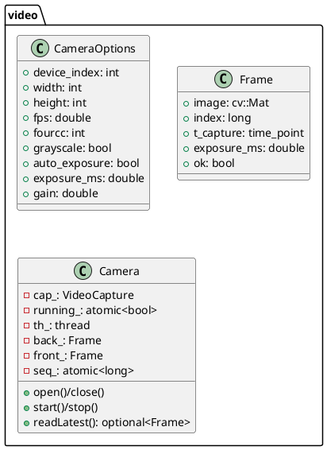
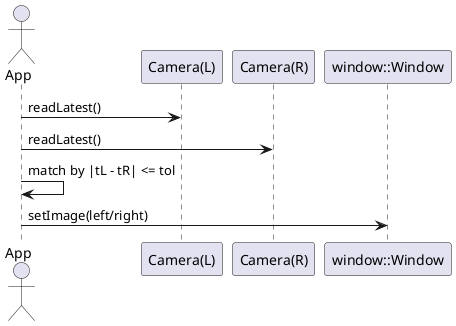

# video パッケージ設計メモ（刷新版）

> 対象: `./src/video/{include/video/*.hpp, *.cpp}`（現行: `camera.hpp/.cpp`）

本メモは **カメラ入力（単眼/ステレオ）** を担う `video` パッケージの設計意図・公開API・実装ポリシー・拡張方針をまとめたものです。Structured-Light / Stereo 用に **露光固定・フレーム同期・二重バッファ** を備え、`app` のゲームループと `window` 描画に滑らかに接続します。

---

## 1. 目的と責務（Scope）

* **カメラ抽象化**：OpenCV `VideoCapture` を包む最小API（Linux: V4L2 を前提）。
* **安定取得**：別スレッドでの連続取得・二重/リングバッファ・タイムスタンプ付与。
* **同期**：2台カメラの**時刻近似同期**（許容Δt内）を提供（Structured-Light/ステレオ用途）。
* **設定管理**：露光/ゲイン/解像度/FPS/フォーマット（FOURCC）等の**UVC/デバイス依存プロパティ**に対応。

非責務：描画（`window`）、コマンド解釈（`app`/`cmd`）、パラメータ保存形式の規約化（`storage`）。

---

## 2. 公開API（案）

```cpp
// include/video/camera.hpp（案）
#pragma once
#include <opencv2/opencv.hpp>
#include <chrono>
#include <optional>
#include <string>
#include <atomic>
#include <thread>
#include <deque>

namespace video {
  struct Frame {
    cv::Mat   image;                     // BGR or GRAY
    int64_t   index{0};                  // 連番
    std::chrono::steady_clock::time_point t_capture; // 取得時刻
    double    exposure_ms{-1};           // 取得時の露光（不明なら<0）
    bool      ok{false};
  };

  struct CameraOptions {
    int       device_index{0};
    int       width{1280};
    int       height{720};
    double    fps{30.0};
    int       fourcc{cv::VideoWriter::fourcc('M','J','P','G')};
    bool      grayscale{false};
    bool      auto_exposure{false};
    double    exposure_ms{10.0};        // auto_exposure=false の時
    double    gain{0.0};                // デバイス依存
  };

  class Camera {
  public:
    explicit Camera(CameraOptions opt);
    ~Camera();

    bool open();                         // VideoCapture を開く
    void close();

    bool start();                        // 取得スレッド開始
    void stop();

    // 直近フレーム（コピーを返す）
    std::optional<Frame> readLatest();   // back->front スワップ後の最新

    // 設定（可能な範囲で即時適用）
    bool setExposureMs(double ms);
    bool setAutoExposure(bool on);
    bool setGain(double value);
    bool setResolution(int w, int h);
    bool setFPS(double fps);
    bool setFourCC(int fourcc);

    const CameraOptions& options() const noexcept { return opt_; }

  private:
    CameraOptions           opt_;
    cv::VideoCapture        cap_;
    std::atomic<bool>       running_{false};
    std::thread             th_;

    // 二重/リングバッファ（最小限：二重）
    Frame                   back_;
    Frame                   front_;
    std::atomic<int64_t>    seq_{0};

    void captureLoop_();
    bool applyOptionsOnce_();            // open 後に1回適用
  };
}
```

```cpp
// （拡張）ステレオ近似同期ユーティリティ（任意）
namespace video {
  struct StereoPair { std::optional<Frame> left, right; };

  class FrameSync {
  public:
    explicit FrameSync(std::chrono::milliseconds tol) : tol_(tol) {}
    StereoPair match(const Frame& a, const Frame& b); // |ta - tb| <= tol でペア
  private:
    std::chrono::milliseconds tol_;
  };
}
```

---

## 3. ライフサイクル

1. **生成**：`Camera cam(opt)`
2. **open**：デバイスを開き、解像度/FPS/FOURCC/露光などを設定
3. **start**：取得スレッドで `cap_.read()` を連続実行→ `back_` を更新
4. **readLatest**：メインスレッドから `front_=back_`（スワップ/コピー）→ `window` に渡して描画
5. **stop/close**：スレッド停止 → デバイス解放

---

## 4. 取得パイプライン & バッファ

* **スレッド**：`captureLoop_()` が `while(running_) cap_.read(mat)` を繰返し、`back_` を更新。
* **タイムスタンプ**：取得直後に `t_capture = steady_clock::now()` を付与。
* **二重バッファ**：`readLatest()` 時に `front_ = back_`（copy）し、アプリ側は `front_.image` を安全利用。
* **リング化**（将来）：`std::deque<Frame>` で N枚保持し、時刻近似検索を可能に。

---

## 5. ステレオ/構造光向け同期

* **近似同期**：2台の `Camera::readLatest()` 結果の時刻差 `|ta - tb|` が `tol` 以下ならペア採用。
* **厳密同期（将来）**：ハードトリガ/GenICam/SDK固有APIが必要（本パッケージでは方針のみ）。
* **Structured-Light**：投影側（`window`）の表示更新と撮影側 `readLatest()` を**キーフレーム単位で同期**（`app` 制御）。

---

## 6. 露光/ゲイン/オート設定

* **原則**：Structured-Light では **オート露光/ホワイトバランスを無効**にし、露光/ゲインを固定。
* **UVC差**：`CAP_PROP_AUTO_EXPOSURE` 等の挙動はデバイス依存。設定失敗時は `warn` ログ + 実値を読み直して通知。
* **グレースケール**：輝度パターン解析では GRAY を推奨（Yチャンネル抽出）。

---

## 7. エラーハンドリング & ロギング

* **open 失敗**：`false` を返し、致命ログ。fallback デバイス/再試行は行わない（運用判断）。
* **read 失敗**：`ok=false` フレームを返す/スキップ。連続失敗で `warn`→`error` のしきい値運用。
* **設定失敗**：デバイスが無視する場合があるため、`cap_.get()` で実値を確認し `info/warn` を出す。

---

## 8. スレッド & パフォーマンス

* **ロック縮小**：`back_` は書き込み専用、`readLatest()` はコピーで干渉回避。
* **コピー最小化**：`cv::Mat` は参照カウントだが、寿命安全のため `front_` への**明示コピー**を基本。
* **FPS整合**：`cap_.set(CAP_PROP_FPS, ...)` は**非保証**。実測 FPS をメタに記録し、上位で同期調整。

---

## 9. CMake / 依存関係

* `video` は **PUBLIC** に `OpenCV::videoio` / **必要に応じて** `OpenCV::imgcodecs` を要求。
* Linux前提（V4L2）：追加リンクは不要（OpenCVが内包）。
* `app` は `video` に **PRIVATE** 依存（`window` へは画像を渡すのみ）。

---

## 10. テスト & 検証チェックリスト

* [ ] open/start/stop/close の順序でリーク/デッドロックがない
* [ ] `readLatest()` のスループットが目標FPSを満たす
* [ ] 露光/ゲイン設定が反映される（`cap_.get` チェック）
* [ ] TWO-CAM：近似同期（Δt≤tol）のペアリング率
* [ ] Structured-Light：投影キーフレームと撮影保存のフレーム番号一致
* [ ] 取得失敗時のリカバリ（連続失敗でのログしきい値）

---

## 11. PlantUML（クラス & シーケンス）





---

## 12. 実装ポリシー（要点）

* **副作用の単一路**：カメラ設定は `video`、描画は `window`、実行順序は `app` が司る（責務分離）。
* **同期は“近似”が既定**：一般UVCデバイスでは厳密同期は期待しない（許容Δtを明示）。
* **設定の検証**：`set*` は `cap_.get` による実値確認を行い、差異はログで通知。
* **保存ポリシ**：Structured-Light は**可逆画像（PNG/TIFF）**を推奨（JPEGは非推奨）。

---

## 13. 将来拡張

* **コマンド統合**：`CmdStartCapture/CmdStopCapture/CmdSetExposure` 等を追加し、`app` の dispatch から操作。
* **GStreamer バックエンド**：`CAP_GSTREAMER` 対応で高FPSや圧縮ストリームに対応。
* **ハード同期**：外部トリガ/Genlock/メーカーSDKでの厳密同期（別モジュール化）。
* **メタ保存**：`Frame` の JSON 伴走（露光/ゲイン/FPS/モニタ情報を記録）
