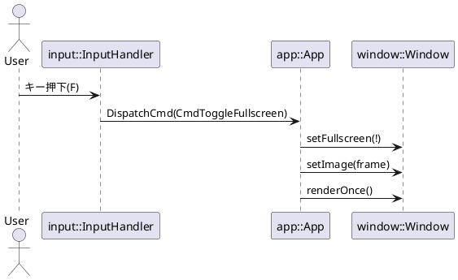

# ウィンドウパッケージ設計メモ（window）

> 対象: `./src/window/{include/window/*.hpp, *.cpp}`

本メモは **マルチウィンドウ描画 / モニタ制御 / レイアウト** を担う `window` パッケージの設計意図・公開API・実装ポリシー・拡張方針をまとめたものです。`app`/`cmd`/`input` と連携し、ゲームループとエンベロープ（コマンド）経由で制御されることを前提にしています。

---

## 1. 目的と責務（Scope）

* **ウィンドウ抽象化**：OpenCV HighGUI 窓に依存した最小APIだが、将来的にバックエンド差し替え可能なインターフェースを意識。
* **モニタ管理**：X11 + RandR を前提に、論理モニタ（index, origin, size, DPI）を列挙。
* **表示制御**：`cv::Mat` を入力として、レイアウト（Fit/Fill/Stretch/Center/ActualSize）に従い表示。
* **フルスクリーン/モニタ移動**：Stereo & 構造光投影用途に、指定モニタへの全画面化を安定提供。
* **副作用の単一化**：描画は **`App::render` からのみ** 行う前提（入力→コマンド→ディスパッチ→適用→描画）。

非責務：入力処理、アプリ全体の状態遷移、カメラ取得、構造光生成。

---

## 2. 公開API（案）

```cpp
// include/window/window_types.hpp
namespace win {
  using WindowId = std::uint32_t;

  enum class WindowMode   { Windowed, Fullscreen };
  enum class LayoutMode   { Fit, Fill, Stretch, Center, ActualSize };

  struct WindowProps {
    WindowId     id{};
    std::string  name;
    int          x{0}, y{0};
    int          width{640}, height{480};
    int          monitor_index{0};
    WindowMode   mode{WindowMode::Windowed};
    LayoutMode   layout{LayoutMode::Fit};
    double       scale{1.0};
    bool         visible{true};
  };
}
```

```cpp
// include/window/monitor.hpp
namespace win {
  struct Monitor {
    int         index{-1};
    std::string name;
    int         x{0}, y{0};   // 原点（仮想デスクトップ座標）
    int         width{0}, height{0};
    double      dpi{96.0};
  };

  // X11/RandR ベースの実装が monitor_x11.cpp に存在
  std::vector<Monitor> enumerate_monitors();
}
```

```cpp
// include/window/window.hpp
namespace win {
  class Window {
  public:
    explicit Window(WindowProps props);
    ~Window();

    // 状態変更
    void setTitle(const std::string& title);
    void setPosition(int x, int y);              // Windowed時のみ有効
    void setSize(int w, int h);                  // Windowed時のみ有効
    void setLayoutMode(LayoutMode m);
    void setFullscreen(bool on);
    void moveToMonitor(int monitor_index);       // modeは維持

    // 表示更新（ダブルバッファ想定）
    void setImage(const cv::Mat& frame);         // バッファに受け取るだけ（スレッド間コピーを許容）
    void renderOnce();                           // 実ウィンドウへ反映（cv::imshow）

    // 参照
    const WindowProps& props() const noexcept { return props_; }

  private:
    WindowProps props_;
    cv::Mat     backbuf_, frontbuf_;             // 画像ダブルバッファ
    bool        dirty_{false};

    // 内部
    void applyFullscreen_();
    void applyWindowed_();
    cv::Size computeLayoutSize_(const cv::Size& src, const cv::Size& dst) const;
  };
}
```

> `current_image` は `Window` が持つのが自然（`App` は所有しない）。`App` は `Window::setImage()` を呼び、描画は `App::render()` 内で `window.renderOnce()` を順巡する。

---

## 3. ライフサイクル

1. **生成**：`App` が `Window` を生成して保持（`std::vector<win::Window>`）。
2. **入力**：`input` が `DispatchCmd` を発行（例: `CmdToggleFullscreen`, `CmdMoveToMonitor`）。
3. **適用**：`app::dispatch` が対象ウィンドウへ API を呼ぶ。
4. **描画**：`App::render` が `Window::renderOnce()` を呼ぶ。
5. **破棄**：`cv::destroyWindow` 相当はデストラクタで安全に実施。

---

## 4. レイアウト（表示スケーリング）

* **Fit**：アスペクト比維持で最大内接。
* **Fill**：アスペクト比維持で最小外接（切り抜き発生）。
* **Stretch**：アスペクト無視で目標サイズにアフィン拡大縮小。
* **Center**：中央配置（拡大せず）。
* **ActualSize**：1:1 表示、スクロールなし（画面外は切れる）。

`computeLayoutSize_(src, dst)` で矩形を算出し、`cv::resize` + `cv::copyTo(ROI)` で合成。

---

## 5. フルスクリーン & モニタ移動

* **フルスクリーン**：HighGUI の `WINDOW_FULLSCREEN` フラグ／または X11 属性変更の2段構え。
* **移動**：`monitor_index` に応じてウィンドウ原点を移動。フルスクリーン時は一旦 `Windowed` に戻してから再適用（安定化）。
* **座標系**：仮想デスクトップ座標（`(monitor.x, monitor.y)` が原点オフセット）。

フェイルセーフ：

* 指定モニタが無効 → 0 にフォールバック
* フルスクリーン失敗 → `Windowed` 維持 + 警告ログ

---

## 6. コマンド適用点（cmd パッケージ連携）

* `CmdToggleFullscreen` → `setFullscreen(!props_.mode)`
* `CmdMoveToMonitor{index}` → `moveToMonitor(index)`
* （拡張）`CmdSetLayout{LayoutMode}`、`CmdSetScale{double}` など

**注意**：実行は必ず `app::dispatch` 経由。`window` は副作用を内包するが、呼び出し点は `dispatch` に一元化。

---

## 7. フォーカスとヒント描画

フォーカスは `App` が管理（`focused_id_`）。視覚的強調が必要なら：

* `Window::renderOnce()` 内でフォーカス時のみ枠線（例：`cv::rectangle`）を重畳するオプションを用意。
* ただしデバッグ用途のみに留め、恒久UIは別レイヤで検討。

---

## 8. スレッド & パフォーマンス

* **描画スレッド**：HighGUI の制約上、UI操作は基本メインスレッドで行う（`cv::waitKey` の呼び場所と整合）。
* **ダブルバッファ**：`setImage()` は入力側からのコピーで `backbuf_` を更新し、`renderOnce()` で `frontbuf_` とスワップ。
* **ゼロコピー最適化**：将来的に同一スレッド／寿命保証ができる場面限定で `cv::Mat::u->refcount` 共有を活用（慎重運用）。

---

## 9. エラーハンドリング & ロギング

* 範囲外モニタ指定、フルスクリーン失敗、`imshow` 例外は `warn` ログ。
* 重大な失敗（ウィンドウ生成不可）は例外送出。
* ログは `logger` パッケージのマクロを使用し、ソース位置（file:line:function）を出力。

---

## 10. CMake / 依存関係

* `window` は **PUBLIC** に `OpenCV::highgui` を要求。
* X11依存は Linux のみリンク（`X11`, `Xrandr`）。CMake の `if(UNIX AND NOT APPLE)` で分岐。
* ヘッダは `include/window` に集約し、`target_include_directories(window PUBLIC include)`。

---

## 11. テスト & 検証チェックリスト

* [ ] モニタ列挙：複数枚・縦置き・異DPIでの正しさ
* [ ] フルスクリーン：トグルの安定性（連打・連続切替）
* [ ] 移動：`Windowed/Fullscreen` それぞれでの monitor 遷移
* [ ] レイアウト：各 `LayoutMode` の幾何が期待通り
* [ ] 画像更新：`setImage` 高頻度呼び出しで tearing / 遅延がない
* [ ] 破棄：`destroyAllWindows` との相互にリソースリークなし

---

## 12. 将来拡張

* **バックエンド抽象化**：HighGUI 以外（SDL2/GLFW/winit+wgpu）への移行レイヤ
* **VSync/タイミング**：投影と撮影の同期（構造光での厳密同期）
* **ウィンドウグループ**：`TargetGroup` を見据えた識別子導入
* **オーバーレイ**：FPS/ヒストグラム等のHUD描画プラグイン
* **ホットリロード**：レイアウト/スケールの動的設定更新（INI/ENV）

---

## 13. PlantUML（クラス & シーケンス）

```plantuml
@startuml
package window {
  class WindowProps {
    +id: uint32
    +name: string
    +x: int
    +y: int
    +width: int
    +height: int
    +monitor_index: int
    +mode: WindowMode
    +layout: LayoutMode
    +scale: double
    +visible: bool
  }

  enum WindowMode { Windowed; Fullscreen }
  enum LayoutMode { Fit; Fill; Stretch; Center; ActualSize }

  class Monitor {
    +index: int
    +name: string
    +x: int
    +y: int
    +width: int
    +height: int
    +dpi: double
  }

  class Window {
    -props_: WindowProps
    -frontbuf_: cv::Mat
    -backbuf_: cv::Mat
    -dirty_: bool
    +setImage(frame)
    +renderOnce()
    +setFullscreen(on)
    +moveToMonitor(index)
  }
}
@enduml
```



---

## 14. 実装ポリシー（要点）

* **単一経路の副作用**：UI副作用は `dispatch` → `window` API 経由のみに限定。
* **循環依存の回避**：`WindowId` は `window_types.hpp` にまとめ、`cmd` からは前方参照可能に。
* **プラットフォーム分岐の隔離**：`monitor_x11.cpp` にX11依存を閉じ、同名シグネチャで将来差し替え。
* **例外/戻り値の基準**：不可逆な失敗は例外、回復可能は `bool`+ログに切り分け。

---

## 15. 既知課題 / リスク

* HighGUI のフルスクリーン挙動は WM に依存があるため、X11で安定化処置が必要（トグル時のちらつき）。
* `cv::destroyWindow` と描画ループの競合（破棄直前フレームでの例外）に注意。
* DPI混在環境での実寸表示（ActualSize）は将来的な DPI スケーリング対応が必要。

---

### 付録：命名規約（要約）

* `WindowId` は `uint32_t`（0 は未割当）
* 列挙は `PascalCase`、メンバは `snake_case_` の接尾
* 画面座標は **左上原点**、右+／下+
