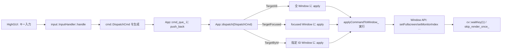

# `input` パッケージ設計メモ

（入力ハンドラ／既定バインディング）

> 対象:
> `./src/input/include/input/{input_handler.hpp, bindings_default.hpp}`
> `./src/input/{input_handler.cpp, bindings_default.cpp}`

---

## 目的と責務

* \*\*キー入力 → コマンド（`DispatchCmd`）\*\*への変換レイヤ。
* **即時実行はしない**（UIイベントは時に連鎖・同時多発するため）。**必ずキューに積む**。

---

## 公開APIの要点

```cpp
// input_handler.hpp（抜粋）
class InputHandler {
public:
  using Action = std::function<void()>;
  void bind(int keycode, Action action);
  void unbind(int keycode);
  bool bound(int keycode) const;
  void clear();
  void handle(int keycode) const; // 未入力(-1)は内部で無視
private:
  std::unordered_map<int, Action> map_;
};

// bindings_default.hpp（抜粋）
void install_default_bindings(
  InputHandler& handler,
  std::deque<DispatchCmd>& dispatch_queue
);
```

* **`bind(key, action)`** でキーにコールバックを登録。
* **`handle(keycode)`** はバインド済アクションを実行（ここで**コマンドをキューに積む**）。
* **HighGUI 未入力**（例: `cv::waitKey()` が `-1`）は `handle()` 内で無視。

---

## 既定バインディング（例）

* `ESC`, `q`, `Q` → `CmdQuit`（宛先: `TargetAll`）
* `F` → `CmdToggleFullscreen`（宛先: `TargetFocused`）
* `'1'`, `'2'` → `CmdMoveToMonitor{1|2}`（宛先: `TargetFocused`）
* `TAB` → `CmdFocusNext`（宛先: `TargetFocused`）

> **ロギング**：`LOG_INFO` を各ハンドラで発行して、運用ログを可視化。
> **整合性**：ログ文言と実処理の齟齬を避ける（例：`'2'` で「フォーカス移動」と表示しない）。

---

## `App` との接続方針（推奨）

* `install_default_bindings(handler, cmd_que_)` を `App` の初期化時に呼ぶ。
* `processInput()` でキーコード取得→ `input_.handle(keycode)` → **キューへ積まれる**。
* 以降は `App::dispatch` が **単一の実行点**として処理。

---

## 設計の注意

* **ラムダの参照キャプチャ**：`[&]` は**寿命・スレッド横断**で破綻しやすい。
  将来、入力と描画を分離するなら、**値キャプチャ**（必要最小限）または**小さな関数オブジェクト**に。
* **スレッド安全性**：同じ `std::deque` に複数スレッドから `push_back` するなら同期が必要（標準コンテナは**同時書き込み非安全**）。

---

## 参考（一般資料）

* *C++ Core Guidelines*（ラムダのキャプチャ指針、F.53 など）
* *cppreference.com*（コンテナのスレッド安全性、`std::unordered_map` など）
* *OpenCV HighGUI*（`waitKey`/`waitKeyEx` の戻り仕様）

---

# `app` との接続（3パッケージのつなぎ方）

> すでに `App` 側の解説メモはお持ちの前提で、**接続要点のみ**列挙します。

## 依存関係（モダンCMake）

* `cmd` は **ヘッダ専用 INTERFACE** ライブラリ（例：`cmd_api`）

  ```cmake
  # src/cmd/CMakeLists.txt
  add_library(cmd_api INTERFACE)
  target_include_directories(cmd_api INTERFACE ${CMAKE_CURRENT_SOURCE_DIR}/include)
  ```
* `input` は `cmd_api` に **PUBLIC 依存**

  ```cmake
  # src/input/CMakeLists.txt
  target_link_libraries(input PUBLIC cmd_api)
  ```
* `app` は `input` に **PRIVATE 依存**（`input` が PUBLIC で `cmd_api` を運ぶ）

  ```cmake
  # src/app/CMakeLists.txt
  target_link_libraries(structured_light_decoder PRIVATE input)
  ```

> **順序**：`add_subdirectory(src/cmd)` → `src/input` → `src/app` の順で読み込む。
> **循環**に注意：`TargetById` が `WindowId` を参照する場合、`window` 側の公開ヘッダが必要になることがある（`INTERFACE` 依存で輸送、あるいは前方宣言で回避）。

---

## ランタイムの流れ（統合像）



> 貼り付けてみてね：https://mermaid.live/edit

* **単一経路の副作用**：UI操作は **必ず `dispatch`** を経由して実行。
* **後処理の一元化**：`finalizeDispatch_()` で HighGUI イベントポンプ＋描画スキップ。

---

## リスクと緩和（客観的指摘）

* **参照キャプチャの寿命問題**：入力→実行の間に**格納／スレッド越境**が生じる設計へ発展すると危険。
  → **値キャプチャ or コピー可能な関数オブジェクト**を基本形に。
* **同時更新のデータ競合**：`cmd_que_` を複数スレッドから操作するなら **ミューテックス** or **ロックフリー構造**へ。
* **ログの整合性**：ログ文言と処理の乖離は運用でバグの原因。**命名・文言の統一**を継続。
* **Target と Window の依存**：`WindowId` 型の所在・公開範囲を明確化（循環を避ける）。

---

## 伸ばしどころ（発展案）

* **コマンド記録・再生**（テストの自動化、バグ再現に有効）
* **ネットワーク入力**：`DispatchCmd` をそのまま遠隔へ送る
* **スクリプト連携**：CLI/JSON/IPC から `DispatchCmd` を組み立てて投入
* **グルーピング**：`TargetGroup` を導入してウィンドウ群制御へ一般化
